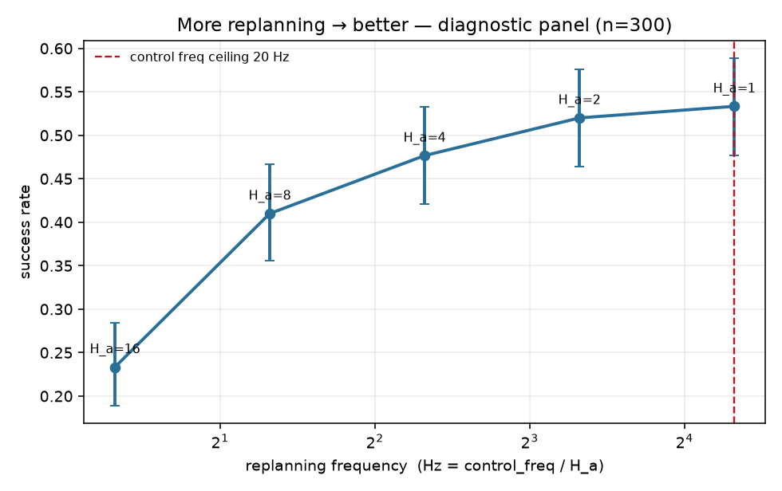
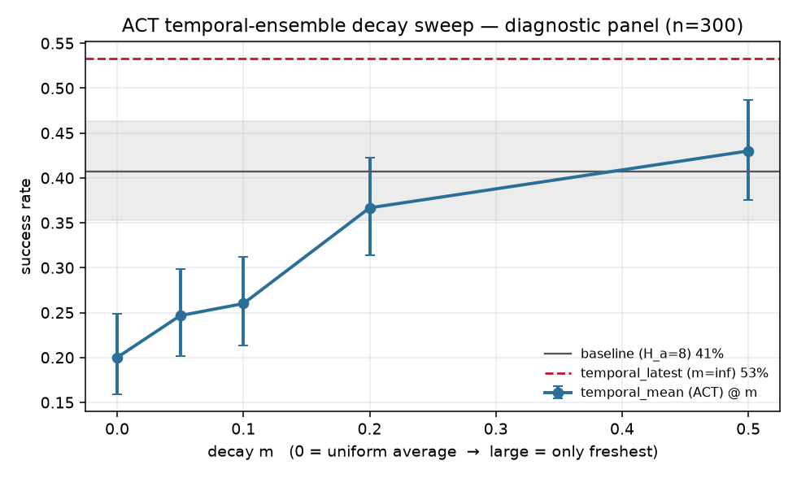
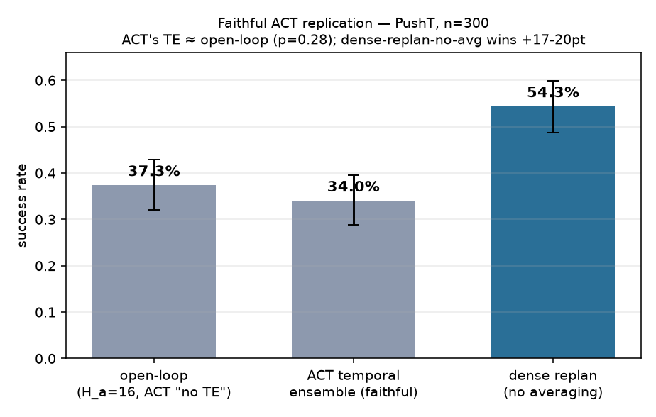

# Findings — temporal ensembling & replan frequency (2026-07-17)

**Development-tier** study: diagnostic panel, n=300 paired episodes, single policy
seed, on PushT-v1 (`active_min`, n=400 demos). Two policies — the diffusion policy
and a **lightweight state-ACT** we built. These are **NOT** frozen-protocol claims
(claims need `final_test` 500 × ≥5 seeds); ACT/DP are lightweight variants
(`deferred_work.md`). Control frequency = **20 Hz**; replan_freq = 20 / H_a.

---

## 1. Headline — replan frequency is *the* lever (diffusion)

Standalone policy, **no ensembling**, sweeping the action horizon H_a:

| H_a | replan freq | success (Wilson 95%) | vs slowest |
|---:|---:|---|---:|
| 16 | 1.25 Hz | 23.3% [18.9, 28.4] | — |
| 8 | 2.5 Hz | 41.0% [35.6, 46.6] | +17.7 * |
| 4 | 5 Hz | 47.7% [42.1, 53.3] | +24.3 * |
| 2 | 10 Hz | 52.0% [46.4, 57.6] | +28.7 * |
| 1 | 20 Hz | 53.3% [47.7, 58.9] | +30.0 * |

**Monotone, +30 pt, every step significant (McNemar p<0.05).** The curve is
**concave** — most gain is escaping the open-loop regime (1.25→2.5 Hz = +17.7 pt);
10→20 Hz is only +1.3 pt, so ~95% of the benefit is reached by 10 Hz. This is the
honest core of the study.

## 2. Averaging is a trap (diffusion)

The temporal-ensemble comparison, and the decay sweep that dissects it:

| system (diffusion) | success | vs baseline |
|---|---|---|
| standalone (H_a=8) | 40.7% | — |
| **temporal_latest** (20 Hz, no avg) | **53.3%** | +12.7 * |
| temporal_mean (averaging) | 26.0% | −14.7 * |
| temporal_projection | 30.7% | −10.0 * |
| temporal_medoid | 41.3% | +0.7 ns |

Decay sweep (amount of averaging): m=0 uniform **20.0%** → 0.05 24.7 → 0.1 26.0 →
0.2 36.7 → 0.5 43.0 → **m=∞ (=latest) 53.3%**. **Perfectly monotone: less averaging
→ better.** "Temporal ensembling"'s apparent value here is *entirely* the dense
replanning it bundles; the averaging only subtracts.

## 3. Same story on ACT (masked, authoritative)

| system (ACT) | success | vs standalone |
|---|---|---|
| standalone (H_a=8) | 47.0% | — |
| **temporal_latest** | **54.3%** | +7.3 * (p=0.003) |
| temporal_mean | 41.0% | −6.0 * (p=0.044) |
| temporal_medoid | 49.7% | +2.7 ns |

Same ordering: **latest > standalone > mean.** Averaging hurts even a *deterministic*
policy — staleness alone does the damage (medoid recovers to baseline). `mean vs
latest` = −13.3 pt (p<0.001).

## 4. Faithful ACT replication (the honest centerpiece)

ACT's **exact** recipe (oldest-weighted, k=0.01, query every step) vs ACT's **exact**
baseline (full-chunk open-loop, H_a=16):

| system (ACT) | success |
|---|---|
| act_openloop (H_a=16, ACT "no TE") | 37.3% |
| act_te (faithful ACT temporal ensemble) | 34.0% |
| act_latest (dense replan, **no avg**) | **54.3%** |

- **ACT's paper claim (TE > open-loop) does NOT reproduce here:** act_te 34.0% vs
  act_openloop 37.3% → **−3.3 pt, p=0.282 (not significant, if anything worse).**
- **Our decomposition point wins decisively:** act_latest vs act_te **+20.3 pt**
  (p<0.001, 67W/6L); vs act_openloop **+17.0 pt** (p<0.001).
- **Oldest-weighting is worse than freshest** (act_te 34.0% < masked temporal_mean
  41.0%) — ACT's exact convention is ~7 pt worse than the freshest-weighted variant
  on this reactive task, as predicted.

**Read honestly:** this is a **scope/transfer** statement, **not** a refutation of
ACT. PushT is coarse, near-unimodal, noise-free — it does not reward the
smoothing/denoising TE provides on precise real manipulation, so on *this* task TE
only exposes its staleness cost. To see TE help, use a task where its strengths pay
off (a precision or multimodal task).

## 5. The mask fix worked; and the compute gap

- **Masking materially improved ACT:** standalone 43.3% → **47.0%**; temporal_mean
  30.3% → **41.0%** (val loss 0.155 → 0.139). The padding-mask critique was right.
  (KL still collapsed → reconstruction improved, latent still unused; expected on
  near-unimodal data.)
- **Compute:** ACT ≈ **1.5 ms/query** vs diffusion ≈ **17 ms** — ~11× faster (single
  pass). This is why ACT trivially sustains 20 Hz under the latency contract
  (`docs/latency_rule.md`).

## Synthesis — one mechanism

> **The freshest observation gives the best action; anything that dilutes it hurts on
> a reactive task.** Dense replanning (act at the freshest observation, every step) is
> the universal winner across *both* policies. Averaging in stale predictions is the
> universal loser — worse the more you average (decay sweep), and worse when you weight
> the *stale* ones more (ACT's oldest convention). ACT's temporal ensembling, run
> faithfully, buys smoothing/denoising that PushT doesn't reward, so it doesn't beat
> open-loop here.

## Caveats
- **Development-tier:** diagnostic panel, single policy seed. Claims need `final_test`
  (500 × ≥5 seeds).
- **Lightweight variants**, not canonical ACT/DP (`deferred_work.md`).
- **Task regime:** PushT cannot show TE's smoothing/multimodality benefits — the
  motivation for a precision / multimodal next task.

## Reproduce
- `scripts/sweep_replan_frequency.py` — replan-frequency proof (§1)
- `scripts/compare_temporal.py`, `scripts/sweep_temporal_decay.py` — §2, §3
- `scripts/replicate_act.py` — faithful ACT replication (§4)
- policies `outputs/active_min/{policy_seed_0, act_masked_seed_0}`; results under
  `outputs/active_min/{temporal, replan_freq, act_masked_temporal, act_replication}`.
